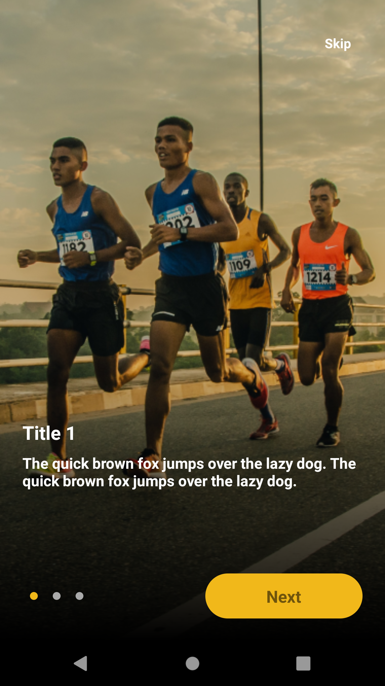
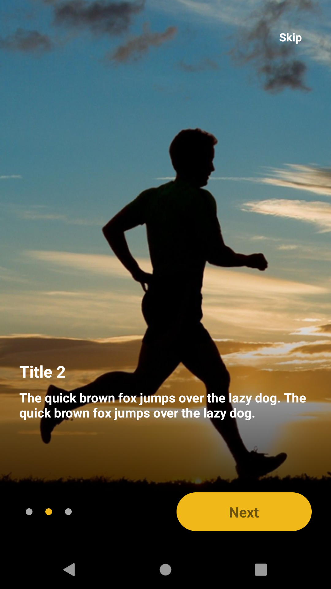
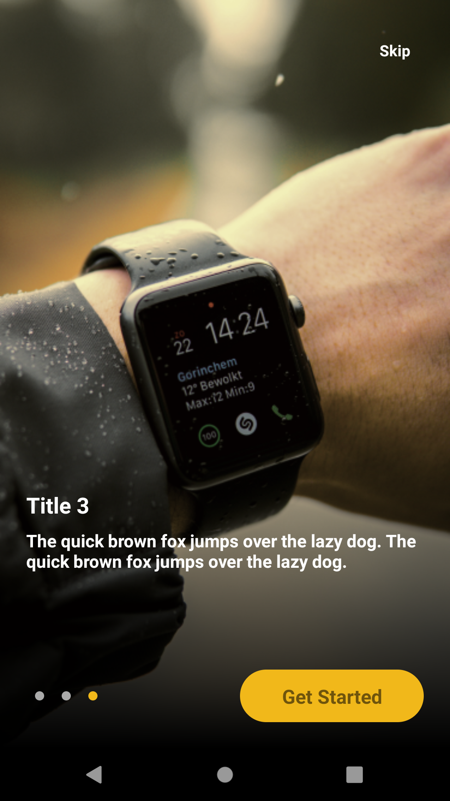
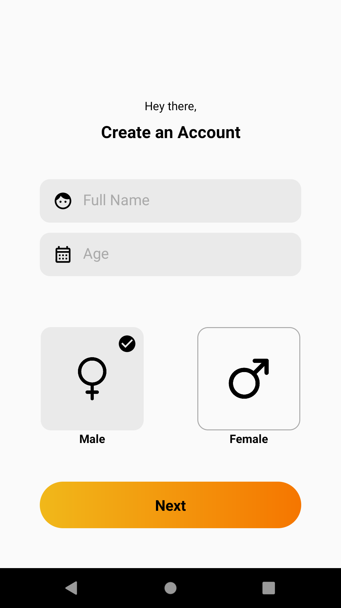
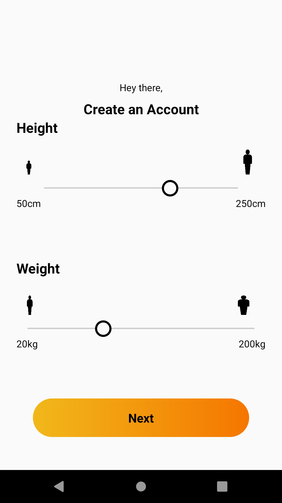
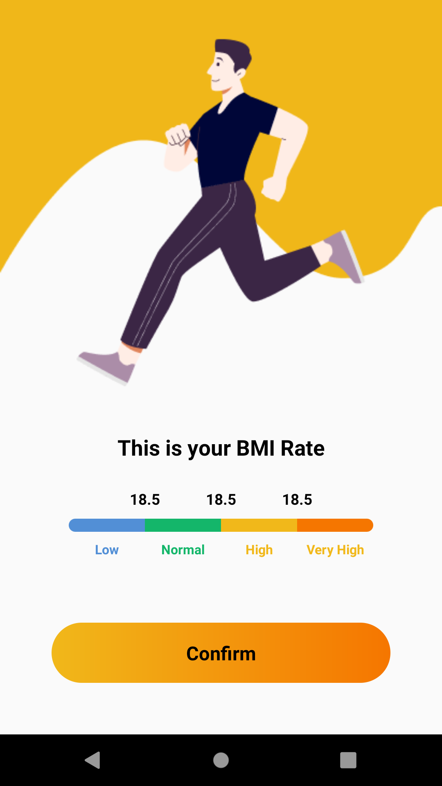

# Android Project: Recreation of Module One - Android Skills Competition

This repository contains a recreation of Module One from the Android Skills Competition. The project focuses exclusively on UI design and animations using XML, Kotlin, and Motion Layout.

## Table of Contents

- [Project Overview](#project-overview)
- [Prerequisites](#prerequisites)
- [Setup Instructions](#setup-instructions)
- [Features](#features)
- [Screenshots](#screenshots)
- [License](#license)

## Project Overview

This project is a recreation of Module One from the Android Skills Competition, focusing purely on front-end development. The aim is to create visually appealing and interactive user interfaces using Motion Layout for animations, with layouts defined in XML and logic implemented in Kotlin. There is no back-end logic, database, or network communication involved—just clean and responsive UI/UX design.

## Prerequisites

Before running this project, ensure you have the following:

- **Android Studio**: Version 4.0 or higher
- **Kotlin**: Basic understanding of Kotlin programming
- **Gradle**: Integrated build system in Android Studio
- **Android SDK**: Updated SDK for Android development
- **JDK**: Java Development Kit 8 or higher

## Setup Instructions

To set up and run the project, follow these steps:

1. **Clone the Repository**:
    ```bash
    git clone [WSC1401 Module1](https://github.com/HadiAgdam/WSC1401_module1.git)
    ```

2. **Open the Project**:
   - Launch Android Studio.
   - Select "Open an existing project".
   - Navigate to the cloned directory and open the project.

3. **Sync the Project**:
   - Android Studio may prompt you to sync the project with Gradle files. Click "Sync Now" to proceed.

4. **Run the App**:
   - Connect an Android device or start an emulator.
   - Click the "Run" button (or press `Shift + F10`) to build and launch the app.

## Features

- **Motion Layout Animations**: Smooth and sophisticated animations created using Motion Layout.
- **XML-Based UI**: User interface elements are entirely defined in XML, ensuring a clean separation between design and logic.
- **Kotlin for UI Control**: Minimal Kotlin code used primarily for UI interactions and state changes.

## Screenshots

Below are some screenshots showcasing the app's UI:


*Itro 1*


*Itro 2*


*Itro 3*


*Name, age and gender form*


*Height and weight form*


*BMI rate*

